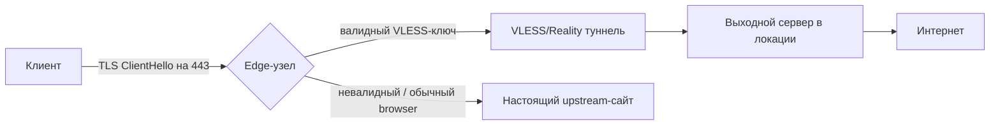

<div align="center">

# INSANE VPN

**Заметки о том, как строится VPN-сервис, который не ловится DPI**


[Telegram-бот](https://t.me/InsaneVPN_bot) · [Сайт](https://my.insanevpn.pro) · [Тарифы](docs/pricing.md) · [FAQ](docs/faq.md)

</div>

---

Я управляю инфраструктурой INSANE VPN. Ниже — как устроены системы DPI, почему одни протоколы блокируются за недели, а другие живут годами, и какие решения мы принимаем при проектировании сети.

## Locations

| Флаг | Страна | Код |
|---|---|---|
|  | United Kingdom | `UK` |
|  | Netherlands | `NL` |
|  | Germany | `DE` |
|  | Switzerland | `CH` |
|  | Sweden | `SE` |
|  | Finland | `FI` |

## Содержание

1. [Что видит DPI на самом деле](#1-что-видит-dpi-на-самом-деле)
2. [Почему шифрование не решает проблему](#2-почему-шифрование-не-решает-проблему)
3. [Идея Reality-подобных схем](#3-идея-reality-подобных-схем)
4. [Архитектура маскировки на уровне узла](#4-архитектура-маскировки-на-уровне-узла)
5. [Почему скорость падает именно при переключении локации](#5-почему-скорость-падает-именно-при-переключении-локации)

---

## 1. Что видит DPI на самом деле

DPI (Deep Packet Inspection) почти никогда не читает содержимое зашифрованного трафика — ему это не нужно. Он классифицирует соединения по **форме**: размерам пакетов, таймингам, байтам handshake, поведению при активном зондировании.

```
Клиент                          DPI-узел                         Сервер
  |                                 |                                |
  |--- TCP SYN -------------------->|------------------------------->|
  |<-- TCP SYN/ACK ------------------|<-------------------------------|
  |--- TLS ClientHello ------------->|------------------------------->|
  |         ↑                        ↑
  |    SNI, JA3/JA4,            статистика:
  |    список cipher suites,    размеры пакетов,
  |    версия TLS               межпакетные интервалы,
  |                              симметричность потока
```

Что конкретно смотрит DPI-система на сетевом уровне:

- **SNI (Server Name Indication)** — домен, к которому идёт TLS-подключение, передаётся в открытом виде в `ClientHello`. Простейшая блокировка — по списку доменов.
- **TLS-фингерпринт (JA3/JA4)** — набор параметров `ClientHello` (cipher suites, extensions, их порядок) уникален для конкретной реализации TLS-стека. У `openssl`, у Chrome, у стандартной библиотеки Go — разные отпечатки. Нестандартный отпечаток — маркер «это не браузер».
- **Статистические признаки потока** — распределение размеров пакетов, интервалы между ними, соотношение трафика клиент→сервер и обратно. У протокола прикладного туннелирования (типичный OpenVPN/IPsec) эти характеристики стабильны и узнаваемы даже без расшифровки.
- **Active probing** — DPI сам подключается к серверу, на который жалуется классификатор, и проверяет: отвечает ли сервер как настоящий HTTPS-сайт, или отдаёт что-то другое на обычный `GET /`.

## 2. Почему шифрование не решает проблему

Шифрование скрывает **содержимое**. Оно не меняет **форму**. Пакет размером 1400 байт, идущий каждые 20мс в обе стороны с характерным паттерном — узнаваем, даже если внутри AES-256.

Именно поэтому классические протоколы стареют быстро:

| Протокол | Узнаваемость | Типичное время жизни под активным DPI |
|---|---|---|
| OpenVPN (стандартный) | Высокая — характерный handshake и опкоды | недели |
| IPsec/IKEv2 | Высокая — фиксированные порты и структура | недели |
| Shadowsocks (без обфускации) | Средняя — трафик однороден, но SNI не виден | месяцы |
| VLESS + Reality / аналоги | Низкая — снаружи неотличим от реального TLS к реальному сайту | наблюдаемо дольше, но не бесконечно |

## 3. Идея Reality-подобных схем

Ключевой трюк: сервер не притворяется HTTPS-сайтом — он **проксирует настоящий TLS-handshake** реального сайта (например, крупного CDN) для всех, кто не знает секрет, и обслуживает VPN-клиента только тех, кто предъявил правильный криптографический ключ прямо во время `ClientHello`.

```
                     ┌───────────────────────────┐
 Обычный browser --->│                            │---> настоящий ответ
                     │   Сервер (порт 443)        │      реального сайта
 DPI probing ------->│   разбирает ClientHello:   │
                     │   есть ли валидный ключ?   │
                     │                            │
 VPN-клиент -------->│   да -> проксирует в VPN   │---> VLESS-туннель
   (знает секрет)     │   нет -> отдаёт настоящий  │
                     │        сайт как есть        │
                     └───────────────────────────┘
```

Для внешнего наблюдателя (в том числе для active probing) сервер на 443 порту — это настоящий HTTPS-сервер настоящего сайта. Отличить VPN-клиента от случайного сканера можно только зная секрет, который передаётся не в отдельном поле, а зашит в структуру самого TLS-handshake.

Это не делает сервис невидимым навечно — если DPI начинает применять ML-классификацию по таймингам самого VLESS-потока (а не только по handshake), различия всё равно можно найти статистически. Поэтому это область, которую приходится пересматривать постоянно, а не настраивать один раз.

Большинство VPN-провайдеров либо не реализуют маскировку вообще, либо прячут её за дополнительными переключателями в приложении, до которых пользователь не доходит. У нас это конфигурация по умолчанию для всех локаций — не опция, а базовое поведение сети.

## 4. Архитектура маскировки на уровне узла



Edge-узел никогда не отвечает «я VPN-сервер» — он либо тихо проксирует в туннель, либо отдаёт настоящий контент. Разница видна только в том, что происходит **после** успешного handshake, а это уже внутри зашифрованного канала.

Требования, из которых мы отталкивались при проектировании:

1. Соединение снаружи неотличимо от обращения к реальному популярному сайту.
2. Active probing не находит признаков VPN.
3. Компрометация одного узла не даёт доступа к секретам остальных.
4. Переключение локации мгновенно для пользователя, без повторной настройки клиента.

Каждая локация — это не просто «ещё один сервер», а отдельный набор ключей маскировки (не переиспользуется между узлами) и отдельный мониторинг статистических аномалий трафика, чтобы вовремя заметить, если конкретный узел начали профилировать. Поэтому у нас 6 локаций с реальной пропускной способностью, а не 20 полупустых.

Сознательно не публикуем: реальные IP-адреса узлов, ключи/сертификаты, точные параметры детектирования аномалий. Публикация этого не помогает пользователям — только облегчает профилирование сети тем, кто её блокирует.

## 5. Почему скорость падает именно при переключении локации

Частая жалоба на VPN — «скорость нормальная, но каждый раз при смене сервера пару секунд всё тормозит». Это не случайность, а сумма нескольких холодных стартов, которые совпадают по времени:

- **TCP slow start заново** — новое соединение к другому серверу начинает congestion window с нуля, а не с той величины, что была прогрета на предыдущем сервере.
- **Reality/TLS handshake с нуля** — маскировочный handshake недёшев по количеству round-trip'ов: нужно договориться о TLS-параметрах, подтвердить ключ, поднять сам VLESS-туннель. Это единицы round-trip'ов, но при высоком RTT до новой локации счёт идёт на сотни миллисекунд.
- **DNS и роутинг** — если клиент резолвит адрес узла заново вместо переиспользования уже прогретой сессии, добавляется ещё один RTT ещё до начала TLS.
- **Смена физического расстояния** — самое очевидное и самое недооценённое: переключение с DE на FI — это другой RTT до сервера просто по географии, независимо от протокола.

Практическое следствие для архитектуры: держать соединение к новому узлу частично прогретым **до** того, как пользователь фактически переключился, а не поднимать его с нуля в момент клика — иначе на "падение скорости" будет жаловаться каждый, кто переключает локацию чаще одного раза в сессию.

---

<div align="center">

Если из всего этого вам нужен не разбор протоколов, а просто рабочий VPN — [бот подключает за 2 минуты](https://t.me/InsaneVPN_bot), 1 день бесплатно.

</div>
