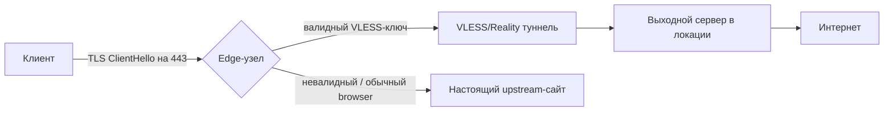

# Архитектура маскировки трафика

Общая схема того, как устроена сеть на уровне протокола — без деталей конкретных серверов и ключей, но с логикой принятия решений.

## Требования, из которых мы отталкивались

1. Соединение снаружи должно быть неотличимо от обращения к реальному популярному сайту.
2. Active probing (сервер сам сканирует подозрительные IP) не должен находить признаков VPN.
3. Компрометация одного узла не должна давать доступ к секретам остальных.
4. Переключение локации должно быть мгновенным для пользователя, без повторной настройки клиента.

## Схема на уровне узла

Edge-узел никогда не отвечает «я VPN-сервер» — он либо тихо проксирует в туннель, либо отдаёт настоящий контент. Разница видна только на уровне того, что происходит **после** успешного handshake, а это уже внутри зашифрованного канала.

## Почему локаций 6, а не 20

Каждая новая локация — это не просто «ещё один сервер». Это:

- отдельный набор ключей маскировки, не переиспользуемый между узлами
- отдельный мониторинг статистических аномалий трафика (чтобы вовремя заметить, если конкретный узел начали профилировать)
- реальная сетевая связность в регионе — иначе локация есть, а толку от неё нет

Мы предпочитаем держать меньше локаций, но с реальной пропускной способностью и актуальной конфигурацией, чем показывать длинный список серверов, половина из которых работает на минимальном канале.

## Что не входит в эту схему

Сознательно не публикуем: реальные IP-адреса узлов, конкретные ключи/сертификаты, точные параметры детектирования, которые используем для мониторинга аномалий. Публикация этого не помогает пользователям — только облегчает профилирование сети тем, кто её блокирует.
